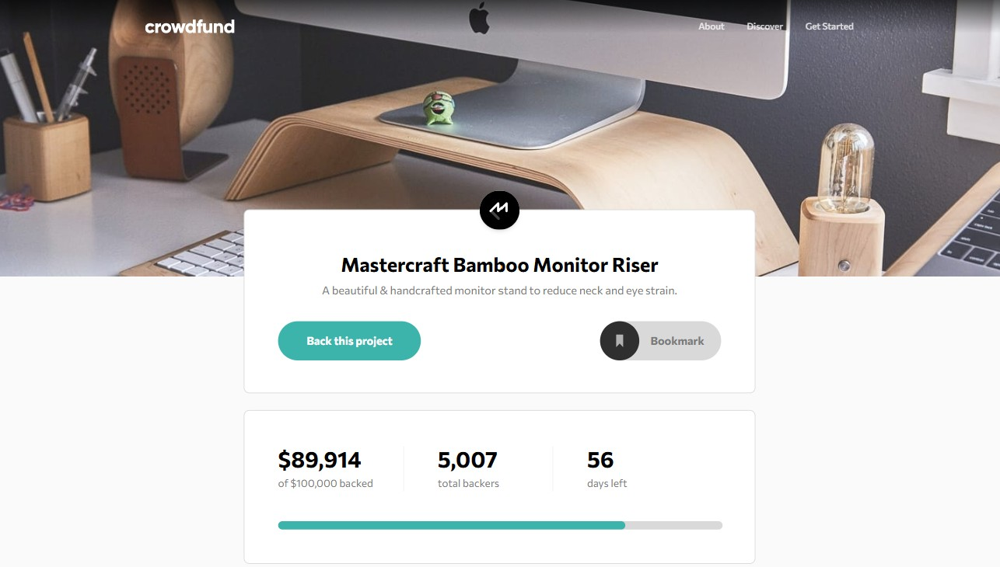
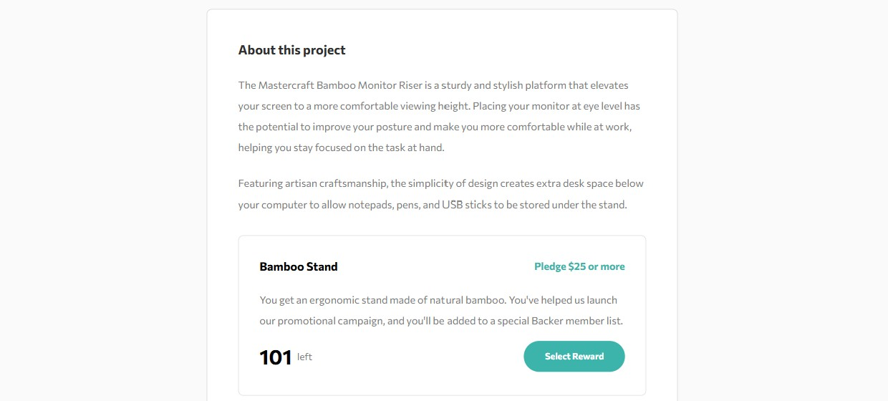
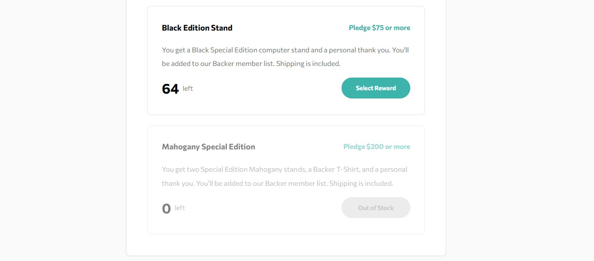

# Crowdfunding Product Page

## Table of contents

- [Overview](#overview)
  - [Screenshot](#screenshot)
  - [Links](#links)
- [My process](#my-process)
  - [Built with](#built-with)
- [Author](#author)

## Overview

### Screenshot

### Links

- Solution URL: [Solution URL](https://github.com/kisu-seo/crowdfunding_product_page)
- Live Site URL: [Live URL](https://kisu-seo.github.io/crowdfunding_product_page/)

## My process

### Built with

- **React 19** — Manages UI state and component architecture, including custom hooks (`useProjectState`) for centralized state management of pledge amounts, backer counts, reward inventory, and modal visibility.
- **Tailwind CSS 4** — Handles all styling via utility classes with a custom `@theme` design token system (colors, typography presets, spacing) and responsive breakpoints including a custom `min-[1028px]` desktop target.
- **Vite 6** — Serves as the frontend build tool, providing fast HMR during development and optimized production builds via `@vitejs/plugin-react` and `@tailwindcss/vite`.
- **Semantic HTML5 & Accessibility (A11y)** — Built with semantic tags (`<main>`, `<section>`, `<article>`), ARIA attributes (`aria-label`, `aria-modal`, `aria-pressed`, `role="dialog"`, `role="progressbar"`), and keyboard-accessible interactive controls throughout.

## Author

- Website - [Kisu Seo](https://github.com/kisu-seo)
- Frontend Mentor - [@kisu-seo](https://www.frontendmentor.io/profile/kisu-seo)
